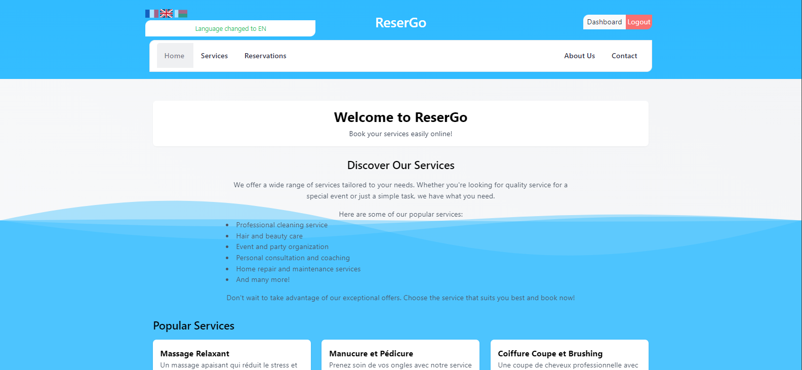
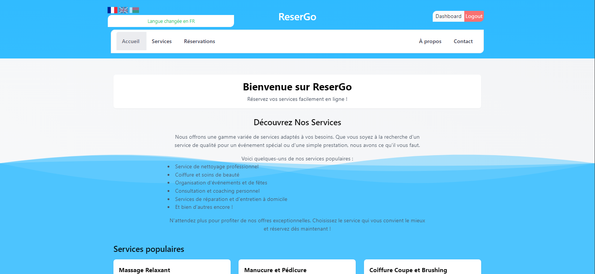

# ReserGo





Bienvenue dans le dépôt **ReserGo** ! Ce projet est une application de réservation de services en ligne, conçue pour simplifier la réservation et la gestion de diverses prestations. Il a été développé en utilisant Laravel 11, GSAP pour les animations, et Tailwind CSS pour le style.

## 📋 Table des matières

- [📝 Description](#-description)
- [✨ Fonctionnalités](#-fonctionnalités)
- [⚙️ Installation](#️-installation)
- [🔧 Configuration](#-configuration)
- [🚀 Utilisation](#-utilisation)
- [👨‍💻 Crédits](#-crédits)
- [📝 Licence](#-licence)

## 📝 Description

**ReserGo** est une plateforme de réservation de services qui permet aux utilisateurs de découvrir et de réserver des services tels que le nettoyage, la coiffure, la réparation à domicile, et bien plus encore. Le projet est construit avec **Laravel 11** et intègre des animations modernes pour améliorer l'expérience utilisateur tout en garantissant une interface simple et réactive.

## ✨ Fonctionnalités

- 🏛️ **Structure MVC** avec Laravel
- 🔑 Administration complète des services et réservations avec accès réservé aux administrateurs, permettant la gestion efficace des services proposés et le suivi des réservations clients
- 🌍 **Internationalisation** : L'application propose un changement de langue dynamique, offrant une expérience utilisateur fluide pour les utilisateurs multilingues.
- 🎨 **Intégration de Tailwind CSS** pour une interface épurée
- 🌀 **Animations dynamiques** avec GSAP
- ⭐ **Gestion des services populaires** et des offres disponibles
- 📄 **Pagination des services**
- 📱 **Interface responsive** pour tous les appareils


## ⚙️ Installation

1. **Clonez le dépôt** :
   ```bash
   git clone https://github.com/Rktoo/ReserGo.git
   cd ReserGo
2. **Installer les dépendances PHP**:
    ```bash
    composer install
3. **Installer les dépendances JS**:
    ```bash
    npm install

## 🔧 Configuration 
1. **Créer votre fichier d'environnement .env** :
    ```bash
    cp .env.example .env
2. **Créer votre clé personnelle** :
   ```bash
   php artisan key:generate

3. **Copier les images statiques du dossier `public/images/services` vers le dossier `storage/app/public/images/services`  exécutez le script suivant dans votre terminal** :
    ```bash
    mkdir -p storage/app/public/images/services
    cp -r public/images/services/* storage/app/public/images/services/
4. **Faites le lien du storage vers le dossier public** :
    ```bash
    php artisan storage:link
5. **Lancer les migrations et le seeding de la base de données :**
    ```bash
   php artisan migrate --seed

## 🚀 Utilisation
1. **Lancer Vite:**
    ```bash
    npm run dev
3. **Lancer le serveur de développement :**
    ```bash
    php artisan serve
4. **Accéder à l'application dans votre navigateur depuis :**
    ```bash
    http://localhost:8000
5. **Vous avez un compte administrateur prédéfini pour tester les fonctionnalités**
    email : admin@test.com
    password : 12345678
## 👨‍💻 Crédits
### Technologies utilisées :
🏛️ Laravel : Framework backend utilisé pour la structure MVC.
🎨 Tailwind CSS : Framework CSS pour un design rapide et réactif.
🌀 GSAP : Pour des animations fluides et modernes.

## 📝 Licence
Ce projet est sous la licence MIT.